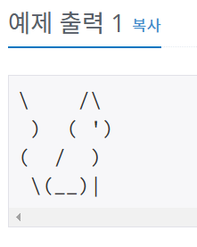

# 고양이
## 문제
아래 예제와 같이 고양이를 출력하시오.

## 입력
없음.

## 출력
고양이를 출력한다.



```c#
using System;
using System.Collections.Generic;
using System.Linq;
using System.Text;
using System.Threading.Tasks;

namespace _02
{
    internal class Program
    {
        static void Main(string[] args)
        {
            // c#에서 \를 출력하기 위해서는 \\ 이렇게 두번 적어주어야한다.
            Console.WriteLine("\\    /\\");
            Console.WriteLine(" )  ( ')");
            Console.WriteLine("(  /  )");
            Console.WriteLine(" \\(__)|");
        }
        

    }
}

``` 
사진처럼 고양이처럼 보이지는 않지만 출력을 해보았다.