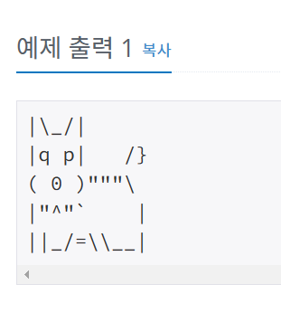

# 개
## 문제
아래 예제와 같이 개를 출력하시오.

## 입력
없음.

## 출력
개를 출력한다.



```c#
using System;
using System.Collections.Generic;
using System.Linq;
using System.Text;
using System.Threading.Tasks;

namespace _02
{
    internal class Program
    {
        static void Main(string[] args)
        {
            // 문자열로 " 을 출력하고 싶으면 앞에 \를 붙이면 됨.
            Console.WriteLine("|\\_/|");
            Console.WriteLine("|q p|   /}");
            Console.WriteLine("( 0 )\"\"\"\\");
            Console.WriteLine("|\"^\"`    |");
            Console.WriteLine("||_/=\\\\__|");
        }
        

    }
}

```

