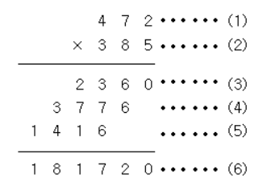

# 곱셈

## 문제
(세 자리 수) × (세 자리 수)는 다음과 같은 과정을 통하여 이루어진다.



(1)과 (2)위치에 들어갈 세 자리 자연수가 주어질 때 (3), (4), (5), (6)위치에 들어갈 값을 구하는 프로그램을 작성하시오.

## 입력
첫째 줄에 (1)의 위치에 들어갈 세 자리 자연수가, 둘째 줄에 (2)의 위치에 들어갈 세자리 자연수가 주어진다.

## 출력
첫째 줄부터 넷째 줄까지 차례대로 (3), (4), (5), (6)에 들어갈 값을 출력한다.

```c#
using System;
using System.Collections.Generic;
using System.Linq;
using System.Text;
using System.Threading.Tasks;

namespace _02
{
    internal class Program
    {
        static void Main(string[] args)
        {
            string a = Console.ReadLine();
            string b = Console.ReadLine();

            Console.WriteLine(int.Parse(a) * (int)Char.GetNumericValue(b[2]));
            Console.WriteLine(int.Parse(a) * (int)Char.GetNumericValue(b[1]));
            Console.WriteLine(int.Parse(a) * (int)Char.GetNumericValue(b[0]));
            Console.WriteLine(int.Parse(a) * int.Parse(b));
        }
    }
}

```

string은 int.Parse를 사용해서 int로 변경할 수 있었지만,

딱 한글자만 존재하는 Char 형식인 경우에는

```(int)Char.GetNumericValue(b[2])```

다음과 같은 방식으로 int형태로 바꿔줄 수 있다.

1의자리 숫자는 b[2]

10의자리 숫자는 b[1]

100의자리 숫자는 b[0]

이므로 차례로 가져와서 곱하면 된다.